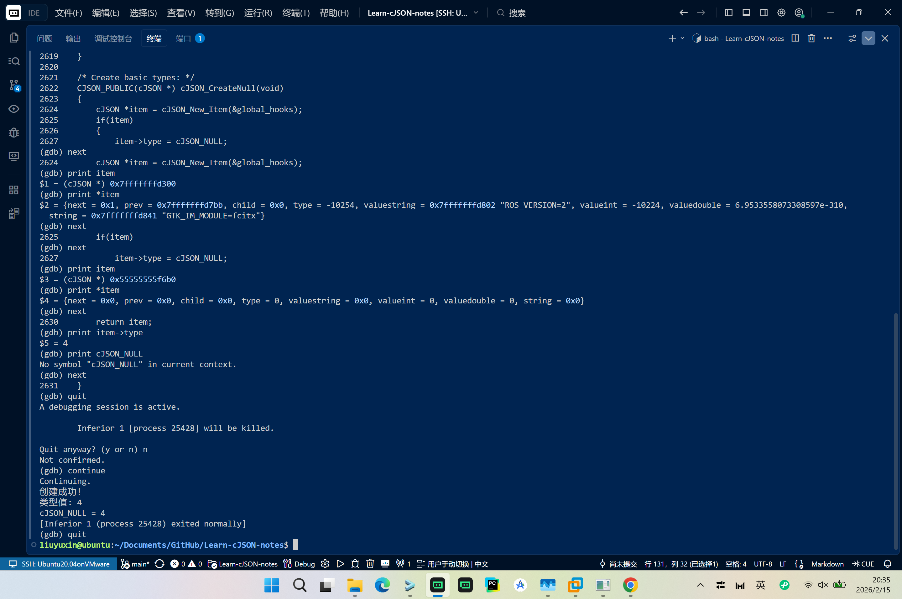
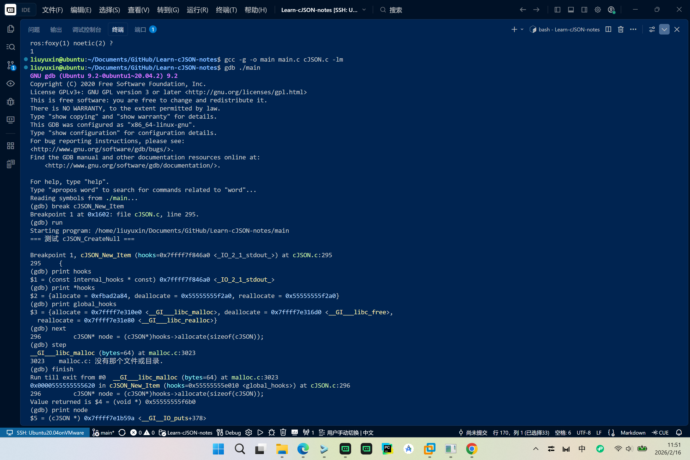
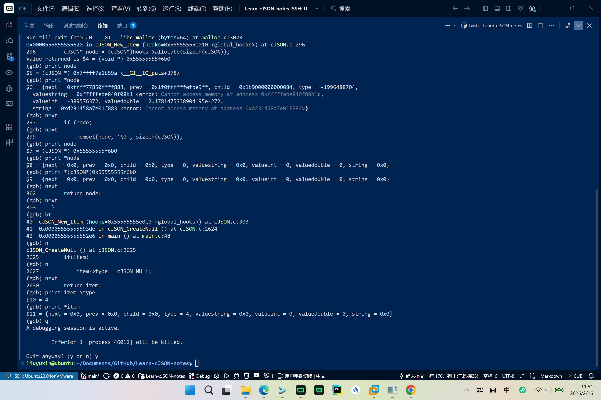
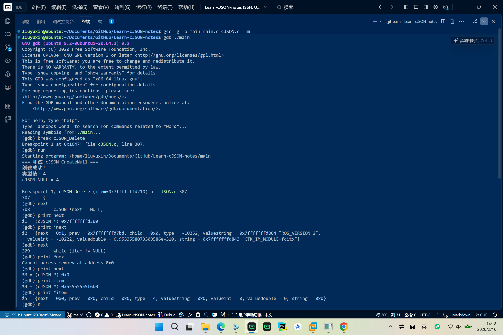
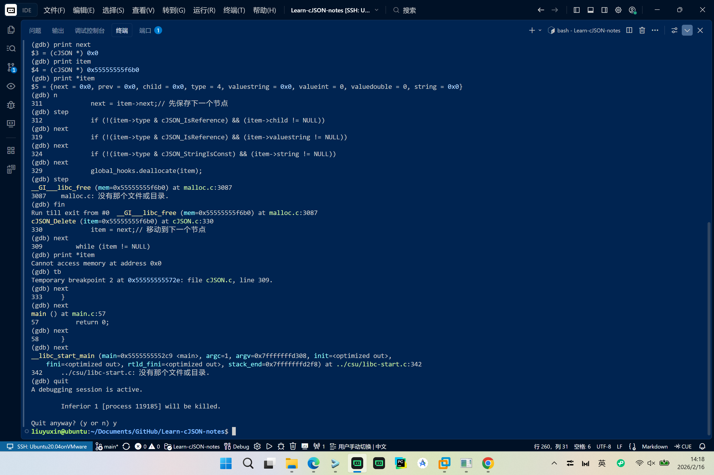
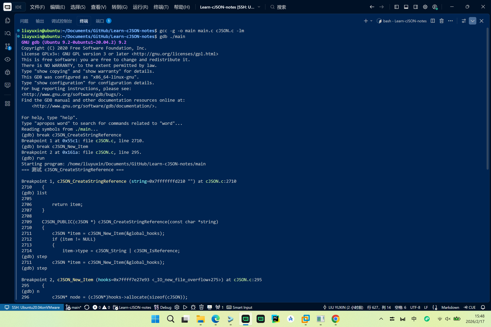
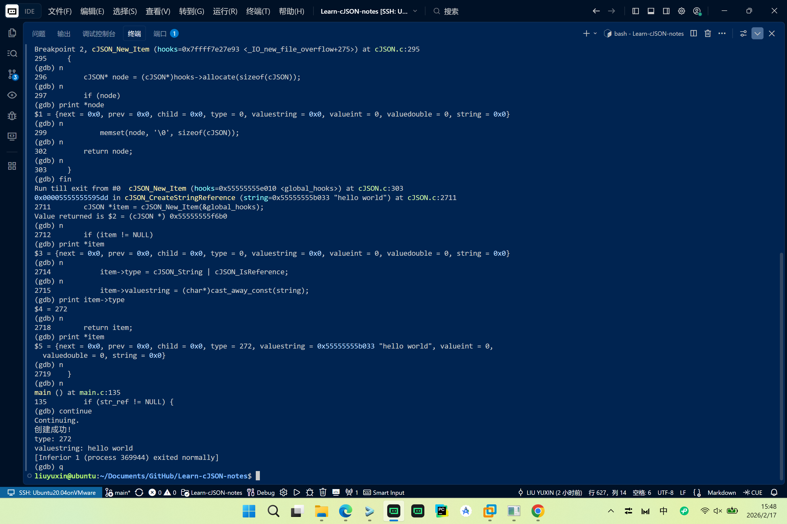

# GDB 调试学习记录 - cJSON

> 目标: 通过 GDB 动态追踪，理解代码执行流程而非静态阅读
> 学习方法: 提出假设 -> 设置断点 -> 单步验证 -> 修正认知
> 起始时间: 2026-02-14
> Author: liuyuxin

---

## 调试环境

- **项目路径**: `~/Documents/GitHub/cJSON/`
- **测试文件**: `~/Documents/GitHub/Learn-cJSON-notes/main.c`
- **编译命令**: `gcc -g -o main main.c cJSON.c -lm`
- **GDB 版本**: 9.2

---

## 核心 GDB 命令速查

```gdb
# 断点管理
break <function/line>     # 设置断点
info breakpoints          # 查看所有断点
delete <n>                # 删除第n个断点
disable/enable <n>        # 禁用/启用断点

# 执行控制
run [args]               # 运行程序
step (s)                 # 单步进入函数
next (n)                 # 单步跳过函数
continue (c)             # 继续执行
finish                   # 执行完当前函数

# 变量查看
print <var>              # 打印变量
print/x <var>            # 十六进制显示
print *ptr@n             # 打印数组前n个元素
display <var>            # 每次停下自动显示

# 代码查看
list (l)                 # 显示当前代码
list <func>              # 显示函数代码
backtrace (bt)           # 查看调用栈
frame <n>                # 切换到第n层栈帧
```

---

## 调试会话记录

### 会话结构模板 | YYYY-MM-DD | 追踪目标：[函数名]

#### 【调试目标】
- **想验证的问题**: ...
- **入口点**: 函数名 + 行号
- **预期**: 我猜代码会怎么做

#### 【GDB 命令序列】
```bash
# 编译
gcc -g -o main main.c cJSON.c -lm

# 启动调试
gdb ./main
(gdb) break 函数名
(gdb) run
```

#### 【执行路径记录】
| 步骤 | 位置 | 操作 | 观察结果 |
|------|------|------|----------|
| 1 | 文件:行号 | 操作描述 | 具体观察 |

#### 【变量状态追踪】
```c
// 关键变量的值变化
// (gdb) print var
// 结果
```

#### 【现场想法】
- 临时想到的、还没验证的疑问
- 觉得奇怪的地方
- 下一步想做什么

#### 【截图】
略

---

### 笔记 01 | 2026-2-15 | 追踪目标：[cJSON_CreateNull]

#### 【调试目标】
 - **问题**: 我想验证 cJSON_CreateNull 如何创建 null 节点?
- **入口点**: cJSON.c:2622
- **预期路径**: 分配内存 -> 设置 type = cJSON_NULL -> 返回节点

#### 【GDB 命令序列】
```gdb
# 编译
gcc -g -o main main.c cJSON.c -lm
# 启动调试
gdb ./main
# 设置的断点
(gdb) break cJSON_CreateNull
(gdb) run
```

#### 【执行路径记录】
| 步骤 | 位置 | 操作 | 观察结果 |
|------|------|------|----------|
| 1 | cJSON.c:2623 | 进入函数 | 停在函数入口，尚未执行 |
| 2 | cJSON.c:2624 | 调用 cJSON_New_Item | 完成内存分配，返回堆地址 0x55555555f6b0 |
| 3 | cJSON.c:2625 | 执行 if(item) 判断 | item 非 NULL，条件成立 |
| 4 | cJSON.c:2627 | 执行赋值 item->type = cJSON_NULL | type 从 0 变为 4 |
| 5 | cJSON.c:2630 | 执行 return item | 返回创建的节点 |

#### 【变量状态追踪】
```c
// 步骤 2: 刚分配内存后
(gdb) print item
$3 = (cJSON *) 0x55555555f6b0
(gdb) print *item
$4 = {next = 0x0, prev = 0x0, child = 0x0, type = 0, valuestring = 0x0,
      valueint = 0, valuedouble = 0, string = 0x0}
// 观察: 堆内存地址(0x5555...)，所有字段被初始化为 0

// 步骤 4: 赋值 type 后
(gdb) print item->type
$5 = 4
// 观察: type 被设置为 4，即 cJSON_NULL 的值
```

#### 【关键发现】

**观察到的现象**：
1. 内存分配返回堆地址 `0x55555555f6b0`（以 0x55 开头，是堆内存特征）
2. 分配后所有字段已清零：type=0, next/prev/child=0x0, valuestring=0x0 等
3. 赋值后 type 从 0 变为 4（cJSON_NULL 的值）

#### 【现场想法】
- 自动清零是防御性编程，省去手动初始化，但清零逻辑在哪?
- 需要单步进入 cJSON_New_Item 看看具体实现
- cJSON_NULL=4，是 1<<2，位运算定义类型的好处是?

#### 【下一步计划】
- [x] cJSON_New_Item 内部是如何分配和清零内存的?
- [ ] global_hooks 是如何初始化的?
- [ ] 如果想追踪 cJSON_CreateString，流程是否类似?

#### 【调试截图】




---

### 笔记 02 | 2026-2-16 | 追踪目标：[cJSON_New_Item]

#### 【调试目标】
- **问题**: cJSON_New_Item 如何分配并清零内存?hooks 机制如何工作?
- **入口点**: cJSON.c:294
- **预期路径**: 调用 hooks->allocate -> memset 清零 -> 返回节点

#### 【GDB 命令序列】
```gdb
# 编译
gcc -g -o main main.c cJSON.c -lm
# 启动
gdb ./main
# 设置断点 - 直接在 cJSON_New_Item 入口
(gdb) break cJSON_New_Item
(gdb) run
```

#### 【执行路径记录】
| 步骤 | 位置 | 操作 | 观察结果 |
|------|------|------|----------|
| 1 | cJSON.c:296 | 调用 hooks->allocate | 进入 __GI___libc_malloc，分配 64 字节 |
| 2 | malloc 返回 | finish 返回 | 返回堆地址 0x55555555f6b0 |
| 3 | cJSON.c:297 | 执行 if(node) 判断 | node 非 NULL，条件成立 |
| 4 | cJSON.c:299 | 执行 memset 清零 | 所有字段从垃圾值变为 0 |
| 5 | cJSON.c:302 | 执行 return node | 返回到 cJSON_CreateNull:2624 |
| 6 | cJSON.c:2627 | 赋值 item->type = cJSON_NULL | type 从 0 变为 4 |

#### 【变量状态追踪】
```c
// 步骤 2: malloc 返回值
(gdb) finish
Value returned is $4 = (void *) 0x55555555f6b0
// 观察: 分配 sizeof(cJSON) = 64 字节

// 步骤 2: global_hooks 内容（正确地址在 finish 后显示）
(gdb) print global_hooks
$3 = {allocate = 0x7ffff7e310e0 <__GI___libc_malloc>,
      deallocate = 0x7ffff7e316d0 <__GI___libc_free>,
      reallocate = 0x7ffff7e31e80 <__GI___libc_realloc>}

// 步骤 4: memset 后
(gdb) print *node
$8 = {next = 0x0, prev = 0x0, child = 0x0, type = 0, valuestring = 0x0,
      valueint = 0, valuedouble = 0, string = 0x0}
// 观察: 所有字段被清零

// 步骤 6: type 赋值后
(gdb) print item->type
$10 = 4
(gdb) print *item
$11 = {next = 0x0, prev = 0x0, child = 0x0, type = 4, valuestring = 0x0,
       valueint = 0, valuedouble = 0, string = 0x0}
```

#### 【关键发现】

**观察到的现象**：
1. `global_hooks` 是全局变量，存储 malloc/free/realloc 的 libc 函数指针
2. cJSON_New_Item 通过 `hooks->allocate(sizeof(cJSON))` 间接调用 malloc，分配 64 字节
3. memset 在分配后立即清零，确保所有指针字段为 NULL、数值字段为 0
4. 调用栈：main -> cJSON_CreateNull -> cJSON_New_Item -> malloc

**GDB 显示异常**：
- 断点停在函数入口时，`hooks` 显示为 `0x7ffff7f846a0 <_IO_2_1_stdout_>`（stdout 地址）
- 但 `finish` 返回后，正确显示 `hooks=0x55555555e010 <global_hooks>`
- 这可能是 GDB 对 static 函数参数的调试符号解析问题，但实际执行正确

#### 【现场想法】
- hooks 机制: cJSON 核心代码不直接调用 malloc，而是通过 hooks 间接调用
- 这样用户可以通过 cJSON_InitHooks 替换内存分配器（如嵌入式场景）
- memset 清零是防御性编程，避免使用未初始化的指针导致崩溃
- 64 字节是 cJSON 结构体大小（8 个指针/整数字段）

#### 【已验证的疑问】
- [x] cJSON_New_Item 在哪清零内存? -> cJSON.c:299，memset(node, '\0', sizeof(cJSON))

#### 【下一步计划】
- [x] cJSON_InitHooks 如何工作?用户如何自定义内存分配器?
- [x] cJSON_Delete 如何配合 hooks 释放内存?
- [ ] 如果分配失败（malloc 返回 NULL），后续流程如何处理?

#### 【调试截图】





---

### 笔记 03 | 2026-2-16 | 追踪目标：[cJSON_Delete]

#### 【调试目标】
- **问题**: cJSON_Delete 如何释放内存?递归删除如何工作?hooks.deallocate 如何被调用?
- **入口点**: cJSON.c:306
- **预期路径**: 遍历链表 -> 递归删除 child -> 释放 valuestring/string -> 释放自身

#### 【GDB 命令序列】
```gdb
# 编译
gcc -g -o main main.c cJSON.c -lm
# 启动
gdb ./main
# 设置断点
(gdb) break cJSON_Delete
(gdb) run
```

#### 【执行路径记录】
| 步骤 | 位置 | 操作 | 观察结果 |
|------|------|------|----------|
| 1 | cJSON.c:307 | 进入函数 | 停在入口，item = 0x55555555f6b0 |
| 2 | cJSON.c:308 | 定义 next = NULL | next = 0x7fffffffd300（垃圾值，内存中原有的数据） |
| 3 | cJSON.c:309 | while 判断 | item 非 NULL，进入循环 |
| 4 | cJSON.c:311 | next = item->next | next = 0x0（item->next 本身就是 NULL） |
| 5 | cJSON.c:312 | if 判断 child | step 进入，然后 next 跳过 |
| 6 | cJSON.c:319 | if 判断 valuestring | next 跳过 |
| 7 | cJSON.c:324 | if 判断 string | next 跳过 |
| 8 | cJSON.c:329 | deallocate(item) | step 进入 __GI___libc_free |
| 9 | cJSON.c:330 | item = next | item = 0x0 |
| 10 | cJSON.c:309 | while 判断 | item = NULL，退出循环 |

#### 【变量状态追踪】
```c
// 步骤 1: 入口参数
(gdb) print item
$4 = (cJSON *) 0x55555555f6b0
(gdb) print *item
$5 = {next = 0x0, prev = 0x0, child = 0x0, type = 4, valuestring = 0x0,
      valueint = 0, valuedouble = 0, string = 0x0}

// 步骤 2: 定义 next 后（垃圾值）
(gdb) print next
$1 = (cJSON *) 0x7fffffffd300
(gdb) print *next
$2 = {next = 0x1, prev = 0x7fffffffd7bd, child = 0x0, type = -10252, ...}
// 观察: 刚定义的指针，值是内存中原有的垃圾数据

// 步骤 4: 赋值 next = item->next 后
(gdb) print next
$3 = (cJSON *) 0x0
// 观察: item->next = NULL，所以 next = 0

// 步骤 8: 进入 free
(gdb) next
329             global_hooks.deallocate(item);
(gdb) step
__GI___libc_free (mem=0x55555555f6b0) at malloc.c:3087
// 观察: 确认调用的是 free，释放堆地址 0x55555555f6b0

// 步骤 10: 释放后
(gdb) print *item
Cannot access memory at address 0x0
// 观察: 内存已被释放，无法访问
```

#### 【关键发现】

**观察到的现象**：
1. cJSON_Delete 使用 while 循环遍历链表，逐个释放节点
2. 释放顺序：先保存 next -> 递归删除 child -> 释放 valuestring -> 释放 string -> 释放自身
3. 通过 `global_hooks.deallocate` 调用 libc 的 free 函数
4. cJSON_IsReference 标志用于判断 valuestring/child 是否需要释放（引用类型不释放）
5. cJSON_StringIsConst 标志用于判断 string 是否需要释放（常量不释放）
6. 本例中 item 是简单节点（type=4, 无 child, 无 valuestring, 无 string），只释放了自身

**调用栈**：
```
main -> cJSON_Delete -> global_hooks.deallocate -> __GI___libc_free
```

#### 【现场想法】
- 递归删除 child 是为了处理嵌套结构（如数组、对象）
- 引用标志位的设计是为了避免重复释放或释放外部数据
- 释放顺序很重要：先递归释放子节点，再释放自身

#### 【已验证的疑问】
- [x] cJSON_Delete 如何配合 hooks 释放内存? -> cJSON.c:329，global_hooks.deallocate

#### 【下一步计划】
- [x] cJSON_Delete 如何配合 hooks 释放内存? -> cJSON.c:329，global_hooks.deallocate
- [x] 深入测试：复杂节点（带 child、valuestring）的递归删除过程

#### 【调试截图】





---

### 笔记 04 | 2026-2-16 | 追踪目标：[cJSON_Delete 递归删除]

#### 【调试目标】
- **问题**: 复杂嵌套 JSON 结构的递归删除如何工作?child 指针如何遍历?
- **入口点**: cJSON.c:306
- **测试数据**: `{"name":"test","items":[{"key":"value1"},{"key":"value2"}],"nested":{"inner":"data"}}`

#### 【GDB 命令序列】
```gdb
# 编译
gcc -g -o main main.c cJSON.c -lm
# 启动
gdb ./main
# 设置断点
(gdb) break cJSON_Delete
(gdb) run
```

#### 【执行路径记录】
| 步骤 | 位置 | 操作 | 观察结果 |
|------|------|------|----------|
| 1 | cJSON.c:307 | 进入 root | item = 0x55555555f6b0, type=64(cJSON_Object), child=0x55555555f700 |
| 2 | cJSON.c:315 | 递归调用 cJSON_Delete(child) | 进入 items 数组 (0x55555555f800) |
| 3 | 递归层1 | items 数组有 child | 递归到 items[0] (0x55555555f8e0, object) |
| 4 | 递归层2 | items[0] 有 child | 递归到 {"key":"value1"} (0x55555555f850, string) |
| 5 | 递归层3 | {"key":"value1"} | type=16, valuestring="value1", string="key", 无 child, 释放并返回 |
| 6 | 递归层2 | items[0] 处理完 | next = 0x0, 继续处理 items[1] (0x55555555f930) |
| 7 | 递归层3 | {"key":"value2"} | type=16, valuestring="value2", string="key", 释放并返回 |
| 8 | 递归层2 | items[1] 处理完 | next = 0x0, items 数组遍历完 |
| 9 | 递归层1 | items 处理完 | 移动到 name 节点 (0x55555555f790, type=32, string 乱码) |
| 10 | 递归层1 | name 节点 | 无 valuestring, 直接释放自身 |
| 11 | 递归层1 | name 处理完 | 移动到 nested (0x55555555f9c0, object) |
| 12 | 递归层2 | nested 有 child | 递归到 {"inner":"data"} (0x55555555fa30) |
| 13 | 递归层3 | {"inner":"data"} | type=16, valuestring="data", string="inner", 释放并返回 |
| 14 | 递归层2 | nested 处理完 | 返回递归层1 |
| 15 | 递归层1 | nested 处理完 | 移动到 next = 0x0, 返回 root |
| 16 | root | 处理完所有 child | 释放 root 自身，退出 |

#### 【变量状态追踪】
```c
// 步骤 1: root 入口
(gdb) print *item
$2 = {next = 0x0, prev = 0x0, child = 0x55555555f700, type = 64, valuestring = 0x0, ...}
// type=64 是 cJSON_Object

// 步骤 3: items 数组
(gdb) print *item
$6 = {next = 0x55555555f8e0, prev = 0x55555555f8e0, child = 0x55555555f850, 
      type = 64, ...}
// 这是 items 数组节点，next 指向 items[0]

// 步骤 4: items[0] object
(gdb) print *item
$12 = {next = 0x0, prev = 0x55555555f800, child = 0x55555555f930, 
       type = 64, ...}

// 步骤 5: {"key":"value1"} 叶子节点
(gdb) print *item
$7 = {next = 0x0, prev = 0x55555555f850, child = 0x0, type = 16, 
      valuestring = 0x55555555f8c0 "value1", string = 0x55555555f8a0 "key"}

// 步骤 11: nested object
(gdb) print *item
$19 = {next = 0x0, prev = 0x55555555f790, child = 0x55555555fa30, 
       type = 64, valuestring = 0x0, string = 0x55555555fa10 "nested"}

// 步骤 13: {"inner":"data"} 叶子节点
(gdb) print *item
$20 = {next = 0x0, prev = 0x55555555fa30, child = 0x0, type = 16, 
       valuestring = 0x55555555faa0 "data", string = 0x55555555fa80 "inner"}

// 调用栈变化
// 入口: #0 cJSON_Delete(root) #1 main
// 步骤2: #0 cJSON_Delete(items) #1 cJSON_Delete(root) #2 main
// 步骤4: #0 cJSON_Delete(items[0]) #1 cJSON_Delete(items) #2 cJSON_Delete(root) #3 main
```

#### 【关键发现】

**递归删除机制**：
1. cJSON_Delete 使用 while 循环遍历链表（通过 next 指针）
2. 当遇到有 child 的节点时，递归调用 cJSON_Delete(item->child) 删除子节点
3. 递归是深度优先：先深入到最底层，再逐层返回处理兄弟节点

**JSON 结构与 cJSON 链表对应**：
```
JSON 结构:
{
    "name": "test",
    "items": [{"key":"value1"}, {"key":"value2"}],
    "nested": {"inner":"data"}
}

cJSON 链表结构 (root.child):
items -> name -> nested
         ↓
         items[0] -> items[1]    (items.child)
         ↓
         items[0].child = {"key":"value1"}  (叶子节点)
         ↓
         items[1].child = {"key":"value2"}  (叶子节点)
         ↓
         nested.child = {"inner":"data"}    (叶子节点)
```

**注意**：调试中发现 name 节点的 string 显示为乱码 `"\200\371UUUU"`，这是因为该内存已被释放，GDB 读取到的是垃圾数据。

**释放顺序**：
1. 递归深入到最深层（叶子节点）
2. 释放叶子节点的 valuestring、string、自身
3. 返回上层，释放该节点的子节点
4. 依此类推，直到根节点

**关键代码路径**：
```c
// cJSON.c:312-315
if (!(item->type & cJSON_IsReference) && (item->child != NULL))
{
    cJSON_Delete(item->child);  // 递归调用
}
```

#### 【现场想法】
- 递归删除确保所有嵌套结构都被正确释放
- next 指针用于遍历同一层的兄弟节点
- child 指针用于进入下一层（触发递归）
- 释放 valuestring 和 string 是因为解析时分配了内存

#### 【下一步计划】
- [x] cJSON_InitHooks 如何工作?
- [x] cJSON_CreateString 流程

#### 【终端记录】
详见 `scripts/04.txt`
[04.txt](./scripts/04.txt)

---
### 笔记 05 | 2026-2-16 | 追踪目标：[cJSON_CreateString]

#### 【调试目标】
- **问题**: cJSON_CreateString 如何创建字符串节点?cJSON_strdup 做了什么?如何完成的复制?
- **入口点**: cJSON.c:2692
- **预期路径**: cJSON_New_Item -> 设置 type -> cJSON_strdup 复制字符串

#### 【GDB 命令序列】
```bash
# 编译
gcc -g -o main main.c cJSON.c -lm
# 启动
gdb ./main
# 设置的断点
(gdb) break cJSON_CreateString
(gdb) break cJSON_New_Item
(gdb) break cJSON_strdup
(gdb) run
```

#### 【执行路径记录】
| 步骤 | 位置 | 操作 | 观察结果 |
|------|------|------|----------|
| 1 | cJSON.c:2694 | 调用 cJSON_New_Item | 进入 cJSON_New_Item |
| 2 | cJSON.c:296 | 分配内存 | malloc(64) 返回 0x55555555f6b0 |
| 3 | cJSON.c:299 | memset 清零 | 所有字段从垃圾值变为 0 |
| 4 | cJSON.c:302 | return node | 返回节点地址 0x55555555f6b0 |
| 5 | cJSON.c:2697 | 赋值 type | type 从 0 变为 16 (cJSON_String) |
| 6 | cJSON.c:2698 | 调用 cJSON_strdup | 进入 cJSON_strdup |
| 7 | cJSON.c:241 | 计算长度 | length = strlen("hello world") + 1 = 12 |
| 8 | cJSON.c:242 | 分配字符串内存 | hooks->allocate(12) 返回 0x55555555f700 |
| 9 | cJSON.c:247 | 复制字符串 | memcpy(copy, string, 12) |
| 10 | cJSON.c:249 | return copy | 返回复制的字符串地址 |
| 11 | cJSON.c:2698 | 赋值 valuestring | valuestring = 0x55555555f700 |
| 12 | cJSON.c:2706 | return item | 返回创建的节点 |

#### 【变量状态追踪】
```c
// 步骤 4: cJSON_New_Item 返回后
(gdb) print item
$6 = (cJSON *) 0x55555555f6b0
(gdb) print *item
$5 = {next = 0x0, prev = 0x0, child = 0x0, type = 0, valuestring = 0x0, ...}

// 步骤 5: type 赋值后
(gdb) print *item
$8 = {next = 0x0, prev = 0x0, child = 0x0, type = 16, valuestring = 0x0, ...}
// 观察: type = 16 (cJSON_String), valuestring 还是 NULL

// 步骤 9: cJSON_strdup 返回后
(gdb) print copy
$9 = (unsigned char *) 0x55555555f700 "hello world"

// 步骤 11: valuestring 赋值后
(gdb) print *item
$10 = {next = 0x0, prev = 0x0, child = 0x0, type = 16, 
       valuestring = 0x55555555f700 "hello world", valueint = 0, ...}
// 观察: 字符串已复制到新内存，节点持有所有权

// 最终输出
创建成功!
type: 16
valuestring: hello world
```

#### 【关键发现】

**cJSON_CreateString 执行流程**:
1. 调用 cJSON_New_Item 分配 cJSON 节点结构（64 字节）
2. 设置 type = cJSON_String (16)
3. 调用 cJSON_strdup 复制字符串内容到新内存
4. 将复制的字符串地址赋值给 valuestring

**cJSON_strdup 实现机制** (cJSON.c:232-250):
1. 计算字符串长度: strlen(string) + 1（包含结尾 \0）
2. 调用 hooks->allocate 分配内存
3. 使用 memcpy 复制字符串内容
4. 返回新分配的字符串地址

**内存布局**:
```
栈区:                     堆区:
+---------------+         +-------------------+
| "hello world" |         | cJSON 节点 (64B)  |
| (输入参数)     |         | type = 16         |
+---------------+         | valuestring --+---+
                          +---------------|---+
                                          |
                                          v
                                   +-------------------+
                                   | "hello world"     |
                                   | (复制的新内存)      |
                                   +-------------------+
```

**关于 malloc 返回已清零内存的疑问**:
- 观察到 malloc 返回后内存已经被清零（所有字段为 0）
- 这是 glibc malloc 的行为（内存分配器优化）
- cJSON 仍然调用 memset 清零，是防御性编程确保跨平台一致性

#### 【现场想法】
- 字符串节点需要独立分配内存存储字符串内容，与节点结构分离
- cJSON_strdup 实现了类似标准库 strdup 的功能，但使用自定义的内存分配器
- 创建的节点拥有字符串内容的所有权，删除时需要释放两段内存

#### 【下一步计划】
- [x] cJSON_InitHooks 如何工作?
- [x] 对比 cJSON_CreateString vs cJSON_CreateStringReference 的区别?

#### 【终端记录】
详见 `scripts/05.txt`
[05.txt](./scripts/05.txt)

---

### 笔记 06 | 2026-2-17 | 追踪目标：[cJSON_CreateStringReference]

#### 【调试目标】
- **问题**: 引用节点与复制节点的区别是什么?cJSON_IsReference 标志如何工作?
- **入口点**: cJSON.c:2709
- **预期路径**: cJSON_New_Item -> 设置 type(含 IsReference) -> 直接引用字符串

#### 【GDB 命令序列】
```bash
# 编译
gcc -g -o main main.c cJSON.c -lm
# 启动
gdb ./main
# 设置断点
(gdb) break cJSON_CreateStringReference
(gdb) break cJSON_New_Item
(gdb) run
```

#### 【执行路径记录】
| 步骤 | 位置 | 操作 | 观察结果 |
|------|------|------|----------|
| 1 | cJSON.c:2711 | 调用 cJSON_New_Item | 分配 64 字节节点 |
| 2 | cJSON.c:296 | 分配内存 | malloc(64) 返回 0x55555555f6b0 |
| 3 | cJSON.c:302 | return node | 返回节点地址 |
| 4 | cJSON.c:2714 | type = cJSON_String \| cJSON_IsReference | type = 272 (16+256) |
| 5 | cJSON.c:2715 | valuestring = cast_away_const(string) | 直接指向外部字符串 |
| 6 | cJSON.c:2718 | return item | 返回节点 |

#### 【变量状态追踪】
```c
// 步骤 3: cJSON_New_Item 返回后
(gdb) print *item
$3 = {next = 0x0, prev = 0x0, child = 0x0, type = 0, valuestring = 0x0, ...}

// 步骤 4: type 赋值后
(gdb) print item->type
$4 = 272

// 步骤 5: valuestring 赋值后
(gdb) print *item
$5 = {next = 0x0, prev = 0x0, child = 0x0, type = 272, 
       valuestring = 0x55555555b033 "hello world", ...}
// 观察: valuestring 直接指向外部字符串地址

// 最终输出
创建成功!
type: 272
valuestring: hello world
```

#### 【关键发现】

**cJSON_CreateStringReference 实现机制**:
1. 分配 cJSON 节点结构（64 字节）
2. 设置 type = cJSON_String | cJSON_IsReference (272)
3. 使用 cast_away_const 将 const char* 转为 char*，直接指向外部字符串
4. 不分配新内存存储字符串内容

**cast_away_const 函数** (cJSON.c:2234):
```c
static void* cast_away_const(const void* string)
{
    return (void*)string;
}
```
- 作用: 去除 const 限定符，使 valuestring 可以指向 const 字符串
- 这是已知安全的类型转换，因为 cJSON 不会修改 valuestring

**内存布局对比**:
```
cJSON_CreateString (复制):
栈区: "hello world"          堆区: [节点] -> [字符串副本]
                                      valuestring 指向堆区

cJSON_CreateStringReference (引用):
栈区: "hello world" --------> 堆区: [节点]
        ↑                      valuestring 指向栈区
    外部字符串地址
```

**两种创建方式对比**:
| 特性 | cJSON_CreateString | cJSON_CreateStringReference |
|------|-------------------|---------------------------|
| 内存分配次数 | 2次 (节点+字符串) | 1次 (仅节点) |
| type 值 | 16 | 272 (16+256) |
| valuestring 指向 | 堆区新分配内存 | 外部字符串地址 |
| 内存所有权 | 节点拥有 | 不拥有，依赖外部生命周期 |
| 删除时释放字符串? | 是 | 否 |

**使用场景**:
- cJSON_CreateString: 普通字符串，cJSON 负责管理内存
- cJSON_CreateStringReference: 常量字符串，避免复制开销，但需外部保证生命周期

#### 【现场想法】
- cJSON_IsReference 标志位通过位运算与 cJSON_String 组合，实现运行时区分
- 引用机制是典型的空间换时间优化，减少内存分配和复制开销
- 使用时需注意: 外部字符串必须比节点存活更久

#### 【下一步计划】
- [x] 对比 cJSON_CreateString vs cJSON_CreateStringReference 的区别?
- [x] cJSON_Delete 如何处理引用节点?（验证不释放 valuestring）

#### 【调试截图】





#### 【终端记录】
详见 `scripts/06.txt`
[06.txt](./scripts/06.txt)

---

### 笔记 07 | 2026-2-17 | 追踪目标：[cJSON_Delete 处理引用节点]

#### 【调试目标】
- **问题**: cJSON_Delete 如何处理引用节点?是否会释放 valuestring?cJSON_IsReference 标志如何工作?
- **入口点**: cJSON.c:306
- **测试数据**: 使用 cJSON_CreateStringReference 创建的引用节点 (type=272)

#### 【GDB 命令序列】
```bash
# 编译
gcc -g -o main main.c cJSON.c -lm
# 启动
gdb ./main
# 设置断点
(gdb) break cJSON_Delete
(gdb) run
```

#### 【执行路径记录】
| 步骤 | 位置 | 操作 | 观察结果 |
|------|------|------|----------|
| 1 | cJSON.c:307 | 进入函数 | item = 0x7fffffffd210 (初始显示为垃圾值) |
| 2 | cJSON.c:308 | 定义 next = NULL | next = 0x0 |
| 3 | cJSON.c:309 | while 判断 | item 非 NULL，进入循环 |
| 4 | cJSON.c:311 | next = item->next | next = 0x0 |
| 5 | cJSON.c:312 | if 判断 child | !(272 & 256) = 0，条件为 false，跳过递归删除 |
| 6 | cJSON.c:319 | if 判断 valuestring | !(272 & 256) = 0，条件为 false，**跳过释放 valuestring** |
| 7 | cJSON.c:324 | if 判断 string | !(0 & 32) = 1，但 string = NULL，跳过 |
| 8 | cJSON.c:329 | deallocate(item) | 只释放节点自身，不释放 valuestring |
| 9 | cJSON.c:330 | item = next | item = 0x0 |
| 10 | cJSON.c:309 | while 判断 | item = NULL，退出循环 |

#### 【变量状态追踪】
```c
// 步骤 1: 入口参数（初始显示异常）
(gdb) p item
$1 = (cJSON *) 0x7fffffffd210

// 步骤 3: 执行一步后，显示正确
(gdb) print *item
$5 = {next = 0x0, prev = 0x0, child = 0x0, type = 272, valuestring = 0x55555555b037 "hello world", valueint = 0, 
  valuedouble = 0, string = 0x0}
// 观察: type = 272, valuestring 指向栈区外部字符串

// 步骤 5: 检查 cJSON_IsReference 标志
(gdb) p item->type & 256
$7 = 256
(gdb) p !(item->type & cJSON_IsReference)
$8 = 0
// 观察: type & cJSON_IsReference = 256，非零为 true，取反为 false

// 步骤 8: 进入 free
(gdb) step
__GI___libc_free (mem=0x55555555f6b0) at malloc.c:3087
// 观察: 只释放节点自身 (0x55555555f6b0)，valuestring 指向的栈区地址未被释放
```

#### 【关键发现】

**cJSON_Delete 处理引用节点的机制**:
1. 通过 `type & cJSON_IsReference` 判断是否为引用节点
2. 当检测到 cJSON_IsReference 标志时，跳过以下操作:
   - 递归删除 child (第312行)
   - 释放 valuestring (第319行)
3. 只释放节点结构自身，不释放 valuestring 指向的外部内存

**执行流程图**:
```
cJSON_Delete(引用节点):
    while (item != NULL):
        next = item->next
        
        // 关键判断: cJSON_IsReference
        if (!(type & cJSON_IsReference) && child != NULL):
            cJSON_Delete(child)    // 引用节点跳过
        
        if (!(type & cJSON_IsReference) && valuestring != NULL):
            deallocate(valuestring) // 引用节点跳过!!!!!
        
        if (!(type & cJSON_StringIsConst) && string != NULL):
            deallocate(string)
        
        deallocate(item)  // 只释放节点自身
        item = next
```

**内存布局验证**:
```
栈区:                      堆区:
+-------------------+      +-------------------+
| "hello world"     |      | cJSON 节点 (64B)  |
| (外部字符串)       |      | type = 272        |
+-------------------+      | valuestring ------+---> 指向栈区
        ↑                  +-------------------+
        |                          
        +---------------------- 不释放，依赖外部生命周期
```

**输出结果**:
```
=== 测试 cJSON_Delete 处理引用节点 ===
创建成功! type=272, valuestring=hello world
准备删除...
删除完成!
```

#### 【现场想法】
- cJSON_IsReference 设计目的: 避免释放外部管理的内存，防止悬空指针
- 引用节点适用场景: 常量字符串、栈区字符串、已由外部管理的内存
- 释放 valuestring 的条件: 必须同时满足两个条件:
  1. !(type & cJSON_IsReference) - 不是引用节点
  2. valuestring != NULL - 确实分配了内存

#### 【已验证的疑问】
- [x] cJSON_Delete 不释放引用节点的 valuestring? -> 验证成功，第319行跳过

#### 【下一步计划】
- [x] cJSON_Delete 处理引用节点 -> 验证完成
- [x] cJSON_InitHooks 如何工作?
- [ ] cJSON_Parse 解析流程

#### 【终端记录】
详见 `scripts/07.txt`
[07.txt](./scripts/07.txt)

---

### 笔记 08 | 2026-2-18 | 追踪目标：[cJSON_InitHooks]

#### 【调试目标】
- **问题**: cJSON_InitHooks 如何设置自定义内存分配器?global_hooks 如何被修改?reallocate 何时启用?
- **入口点**: cJSON.c:254
- **预期路径**: 检查hooks参数 -> 设置global_hooks各字段 -> 处理reallocate逻辑

#### 【GDB 命令序列】
```bash
# 编译
gcc -g -o main main.c cJSON.c -lm
# 启动
gdb ./main
# 设置断点
(gdb) break cJSON_InitHooks
(gdb) break cJSON_New_Item
(gdb) run
```

#### 【执行路径记录】
| 步骤 | 位置 | 操作 | 观察结果 |
|------|------|------|----------|
| 1 | cJSON.c:295 | 调用 cJSON_New_Item(默认分配器) | 分配64字节，返回 0x55555555f6b0 |
| 2 | 输出 | 创建字符串"hello" | 使用默认malloc，无计数输出 |
| 3 | cJSON.c:255 | 进入 cJSON_InitHooks | hooks参数指向自定义分配器结构 |
| 4 | cJSON.c:259 | if (hooks == NULL) | 条件为false，跳过默认初始化 |
| 5 | cJSON.c:268 | global_hooks.allocate = malloc | 先设为默认malloc |
| 6 | cJSON.c:269 | if (hooks->malloc_fn != NULL) | 条件为true，my_malloc有效 |
| 7 | cJSON.c:271 | global_hooks.allocate = hooks->malloc_fn | 设置为my_malloc |
| 8 | cJSON.c:274 | global_hooks.deallocate = free | 先设为默认free |
| 9 | cJSON.c:275 | if (hooks->free_fn != NULL) | 条件为true，my_free有效 |
| 10 | cJSON.c:277 | global_hooks.deallocate = hooks->free_fn | 设置为my_free |
| 11 | cJSON.c:285 | global_hooks.reallocate = NULL | 初始化为NULL |
| 12 | cJSON.c:286 | 检查是否使用标准分配器 | allocate!=malloc且deallocate!=free，reallocate保持NULL |
| 13 | cJSON.c:295 | 调用 cJSON_New_Item(自定义分配器) | [自定义malloc] size=64, ptr=0x55555555f6b0, 次数=1 |
| 14 | cJSON.c:2694 | 分配valuestring内存 | [自定义malloc] size=6, ptr=0x55555555f700, 次数=2 |
| 15 | cJSON.c:329 | 删除节点 | [自定义free] ptr=0x55555555f700, 次数=1；[自定义free] ptr=0x55555555f6b0, 次数=2 |
| 16 | cJSON.c:255 | 再次进入 cJSON_InitHooks(NULL) | 重置为默认分配器 |
| 17 | cJSON.c:259 | if (hooks == NULL) | 条件为true，使用默认malloc/free/realloc |
| 18 | cJSON.c:295 | 创建"default again" | 使用默认分配器，无计数输出 |

#### 【变量状态追踪】
```c
// 步骤3: 进入cJSON_InitHooks前
(gdb) print *hooks
$1 = {malloc_fn = 0x1, free_fn = 0x7fffffffd7b8}
(gdb) print global_hooks
$2 = {allocate = 0x5555555551f0 <malloc@plt>, 
      deallocate = 0x555555555130 <free@plt>, 
      reallocate = 0x7ffff7e31e80 <__GI___libc_realloc>}

// 步骤5-6: 设置allocate前
(gdb) print hooks->malloc_fn
$3 = (void *(*)(size_t)) 0x555555555309 <my_malloc>
(gdb) print hooks->free_fn
$4 = (void (*)(void *)) 0x555555555364 <my_free>
(gdb) print global_hooks.allocate
$5 = (void *(*)(size_t)) 0x5555555551f0 <malloc@plt>

// 步骤7: 设置allocate后
(gdb) print global_hooks.allocate
$7 = (void *(*)(size_t)) 0x555555555309 <my_malloc>

// 步骤10: 设置deallocate后
(gdb) print global_hooks.deallocate
$10 = (void (*)(void *)) 0x555555555364 <my_free>

// 步骤11-12: reallocate被设为NULL
(gdb) print global_hooks.reallocate
$12 = (void *(*)(void *, size_t)) 0x0
```

#### 【关键发现】

**cJSON_InitHooks 工作机制**:
1. **NULL参数处理**: 如果hooks为NULL，则重置global_hooks为标准malloc/free/realloc
2. **allocate设置**: 先设为默认malloc，如果hooks->malloc_fn不为NULL则覆盖为自定义函数
3. **deallocate设置**: 先设为默认free，如果hooks->free_fn不为NULL则覆盖为自定义函数
4. **reallocate设置**: 初始化为NULL，只有当allocate和deallocate都是标准库函数时，才设为realloc

**执行流程图**:
```
cJSON_InitHooks(hooks):
    if (hooks == NULL):
        global_hooks = {malloc, free, realloc}  // 重置为默认
        return
    
    // 设置allocate
    global_hooks.allocate = malloc
    if (hooks->malloc_fn != NULL):
        global_hooks.allocate = hooks->malloc_fn
    
    // 设置deallocate
    global_hooks.deallocate = free
    if (hooks->free_fn != NULL):
        global_hooks.deallocate = hooks->free_fn
    
    // 设置reallocate
    global_hooks.reallocate = NULL
    if (global_hooks.allocate == malloc && global_hooks.deallocate == free):
        global_hooks.reallocate = realloc  // 仅当使用标准分配器时启用
```

**内存分配器切换验证**:
```
阶段1: 默认分配器
  cJSON_CreateString -> cJSON_New_Item -> malloc (无输出)

阶段2: 自定义分配器  
  cJSON_CreateString -> cJSON_New_Item -> my_malloc (输出计数)
  创建valuestring -> my_malloc (输出计数)
  
阶段3: 重置默认
  cJSON_InitHooks(NULL) -> 恢复malloc/free
  cJSON_CreateString -> malloc (无输出)
```

**reallocate == NULL时的处理**:
- 当使用自定义分配器时，global_hooks.reallocate被设为NULL
- cJSON内部会在需要reallocate的地方检查该字段，如果为NULL则使用allocate+memcpy+deallocate的组合来模拟realloc

#### 【现场想法】
- cJSON_InitHooks允许嵌入式系统或特殊环境替换内存分配器（如使用内存池、跟踪分配等）
- reallocate只有在确认使用标准malloc/free时才启用，确保行为一致性
- 自定义分配器可以用来调试内存泄漏（通过计数）、监控分配大小等
- 输出中的alloc_count=2, free_count=2验证了两次分配（节点+字符串）和两次释放

#### 【已验证的疑问】
- [x] global_hooks如何被修改? -> 通过函数指针赋值，第268-277行
- [x] reallocate何时启用? -> 仅当使用标准malloc/free时，第286-287行
- [x] cJSON_InitHooks(NULL)如何重置? -> 直接设为malloc/free/realloc，第261-265行

#### 【下一步计划】
- [ ] 探索reallocate为NULL时的替代实现逻辑
- [ ] 测试cJSON_Parse使用自定义分配器的场景

#### 【终端记录】
详见 `scripts/08.txt`
[08.txt](./scripts/08.txt)

---

### 笔记 09 | 2026-02-18 | 追踪目标：[cJSON_Parse]

#### 【调试目标】
- **问题**: cJSON_Parse如何解析JSON字符串？从入口到parse_value的调用链是什么？
- **入口点**: cJSON.c:1034 (cJSON_Parse函数)
- **预期路径**: cJSON_Parse -> cJSON_ParseWithOpts -> cJSON_ParseWithLengthOpts -> parse_value -> parse_object

#### 【GDB 命令序列】
```bash
# 编译
gcc -g -o main main.c cJSON.c -lm
# 启动调试
gdb ./main
# 设置断点
(gdb) break cJSON_Parse
(gdb) break cJSON_ParseWithOpts
# 建议设置断点 (gdb) break cJSON_ParseWithLengthOpts, 本次分析没有设置
(gdb) break parse_value
(gdb) break parse_object
(gdb) run
```

#### 【执行路径记录】
| 步骤 | 位置 | 操作 | 观察结果 |
|------|------|------|----------|
| 1 | cJSON.c:1399 | 进入 cJSON_Parse | 入口函数，value 指向输入字符串 `{"a":1}` |
| 2 | cJSON.c:1400 | 调用 cJSON_ParseWithOpts | 参数 return_parse_end=0, require_null_terminated=0 |
| 3 | cJSON.c:1303 | 计算 buffer_length | strlen(value) + sizeof("")，结果为 8 |
| 4 | cJSON.c:1305 | 调用 cJSON_ParseWithLengthOpts | 内部调用，未停断点 |
| 5 | cJSON.c:1540 | 进入 parse_value | 核心分派函数，检查 input_buffer |
| 6 | cJSON.c:1548 | 检查 null | 不匹配（开头是 `{`） |
| 7 | cJSON.c:1555 | 检查 false | 不匹配 |
| 8 | cJSON.c:1562 | 检查 true | 不匹配 |
| 9 | cJSON.c:1570 | 检查 string | 不匹配（开头是 `{` 而非 `"`） |
| 10 | cJSON.c:1575 | 检查 number | 不匹配（开头是 `{` 而非数字） |
| 11 | cJSON.c:1580 | 检查 array | 不匹配（开头是 `{` 而非 `[`） |
| 12 | cJSON.c:1585 | 检查 object | **匹配！buffer_at_offset[0] == '{'** |
| 13 | cJSON.c:1587 | 调用 parse_object | 进入对象解析函数 |
| 14 | cJSON.c:1829 | 进入 parse_object | 准备解析对象内容 |
| 15 | cJSON.c:1833 | 检查深度限制 | 当前 depth=0，未超限 |
| 16 | cJSON.c:1837 | depth++ | 深度增加到 1 |
| 17 | cJSON.c:1839 | 检查开头 '{' | 匹配，确认为对象 |
| 18 | cJSON.c:1844 | offset++ | 跳过 '{'，offset 从 0→1 |
| 19 | cJSON.c:1845 | buffer_skip_whitespace | 跳过空白（无空白） |
| 20 | cJSON.c:1846 | 检查空对象 | 不是 `}`，非空对象 |
| 21 | cJSON.c:1859 | offset-- | 为循环逻辑调整 offset |
| 22 | cJSON.c:1864 | 调用 cJSON_New_Item | 分配新节点存储键值对 |
| 23 | cJSON.c:296 | 分配内存 | hooks->allocate 分配 64 字节，返回 0x55555555f2f0 |
| 24 | cJSON.c:299 | memset 清零 | 所有字段初始化为 0 |
| 25 | cJSON.c:302 | 返回 node | 返回到 parse_object:1864 |
| 26 | cJSON.c:1874 | head = new_item | 初始化链表头 |
| 27 | cJSON.c:1890 | offset++ | 调整 offset 准备解析键 |
| 28 | cJSON.c:1891 | buffer_skip_whitespace | 跳过空白 |
| 29 | cJSON.c:1892 | 调用 parse_string | 解析键名 "a" |
| 30 | cJSON.c:958 | 进入 parse_string | 开始字符串解析 |
| 31 | cJSON.c:979 | while 循环找结尾 | 找到 `"` 位置，字符串长度为 1（"a"） |
| 32 | cJSON.c:1004 | 分配内存 | allocate(2) 分配 2 字节存储 "a\0" |
| 33 | cJSON.c:1018 | memcpy 复制 | 复制字符 'a' 到 output |
| 34 | cJSON.c:1071 | 添加 '\0' | 字符串结束符 |
| 35 | cJSON.c:1073 | 设置 type | item->type = cJSON_String (16) |
| 36 | cJSON.c:1074 | 设置 valuestring | item->valuestring = "a" |
| 37 | cJSON.c:1077 | offset++ | 跳过结尾 `"`，offset 更新 |
| 38 | cJSON.c:1079 | 返回 true | 返回到 parse_object:1892 |
| 39 | cJSON.c:1899 | 移动键名 | current_item->string = valuestring（键名移到 string 字段） |
| 40 | cJSON.c:1900 | 清空 valuestring | current_item->valuestring = NULL（准备存值） |
| 41 | cJSON.c:1908 | offset++ | 跳过冒号 ':'，offset 从 4→5 |
| 42 | cJSON.c:1909 | buffer_skip_whitespace | 跳过空白（无空白） |
| 43 | cJSON.c:1910 | 调用 parse_value | **递归调用，解析值 "1"** |
| 44 | cJSON.c:1540 | 再次进入 parse_value | 第二次进入，解析值部分 |
| 45 | cJSON.c:1575 | 检查 number | **匹配！buffer_at_offset[0] == '1'** |
| 46 | cJSON.c:1577 | 调用 parse_number | 进入数字解析 |
| 47 | cJSON.c:419 | for 循环 | 遍历数字字符 |
| 48 | cJSON.c:439 | 记录长度 | number_string_length = 1（数字 "1"） |
| 49 | cJSON.c:454 | 分配内存 | allocate(2) 存储 "1\0" |
| 50 | cJSON.c:460 | memcpy 复制 | 复制 "1" |
| 51 | cJSON.c:488 | 调用 strtod | 将字符串 "1" 转换为 double 类型数字 1.0 |
| 52 | - | 程序完成 | parse_number 返回，逐层返回到 main，程序正常退出 |

#### 【变量状态追踪】

```c
// 步骤 23: cJSON_New_Item 返回后
(gdb) print node
$2 = (cJSON *) 0x55555555f2f0
(gdb) print *node
$3 = {next = 0x0, prev = 0x0, child = 0x0, type = 0, valuestring = 0x0, valueint = 0, 
      valuedouble = 0, string = 0x0}

// 步骤 31: parse_string 中找到字符串
(gdb) print input_end
$4 = (const unsigned char *) 0x55555555b006 "a\":1}"
(gdb) print input_pointer
$5 = (const unsigned char *) 0x55555555b006 "a\":1}"

// 步骤 34: 分配字符串内存后
(gdb) print number_c_string
$16 = (unsigned char *) 0x55555555f360 ""
(gdb) print number_c_string
$17 = (unsigned char *) 0x55555555f360 "1"

// 步骤 36: parse_string 设置 valuestring 后
(gdb) print *item
$9 = {next = 0x0, prev = 0x0, child = 0x0, type = 16, valuestring = 0x55555555f340 "a", 
      valueint = 0, valuedouble = 0, string = 0x0}

// 步骤 41: 跳过冒号后
(gdb) print input_buffer->content[input_buffer->offset]
$10 = 58 ':'
(gdb) print input_buffer->offset
$11 = 4
// 跳过后
(gdb) print input_buffer->offset
$12 = 5

// 步骤 43: 第二次进入 parse_value 前的 buffer 状态
(gdb) print *input_buffer
$14 = {content = 0x55555555b004 "{\"a\":1}", length = 8, offset = 5, depth = 1, hooks = {
    allocate = 0x7ffff7e310e0 <__GI___libc_malloc>, deallocate = 0x7ffff7e316d0 <__GI___libc_free>, 
    reallocate = 0x7ffff7e31e80 <__GI___libc_realloc>}}
```

#### 【关键发现】

**观察到的现象**：

1. **parse_value 的递归特性**：
   - 第一次调用 parse_value 时解析整个 JSON，根据 `{` 分派到 parse_object
   - parse_object 在解析完键名后，再次调用 parse_value 解析值部分
   - 这是递归下降解析器的核心：parse_object → parse_value → parse_number

2. **键值对的处理方式**：
   - 键名先由 parse_string 解析到 `valuestring`
   - 然后手动移到 `string` 字段：`current_item->string = current_item->valuestring`
   - 最后清空 `valuestring = NULL`，为存储值做准备
   - 值解析后存到 `valuestring`（字符串/数字）或 `valuedouble`（数字）

3. **对象链表的构建**：
   - `head` 指向链表头，`current_item` 指向当前处理的节点
   - 第一个键值对时：`head = current_item = new_item`
   - 后续键值对通过 `next` 指针连接（本例只有一个键值对，未展示）

4. **字符串解析流程**：
   - 先遍历找到结尾 `"`，计算长度
   - 分配内存（长度+1，包含 `\0`）
   - memcpy 复制内容
   - 无需转义处理（"a" 无转义字符）

5. **数字解析流程**：
   - 提取数字字符（"1"）到临时缓冲区
   - 调用 strtod 转换为 double
   - 返回后设置到节点的 value 字段

**调用栈**（完整嵌套关系）：
```
#0 parse_number (cJSON.c:401)
#1 parse_value (cJSON.c:1577)
#2 parse_object (cJSON.c:1910)  <- 第二次调用 parse_value
#3 parse_value (cJSON.c:1587)
#4 cJSON_ParseWithLengthOpts (内部)
#5 cJSON_ParseWithOpts (cJSON.c:1305)
#6 cJSON_Parse (cJSON.c:1400)
#7 main (main.c:236)
```

**内存布局**（解析 `{"a":1}` 后）：
```
根节点 (cJSON_Object, type=64)
    ├── child ────▶ 键值对节点 (第一个子节点)
    │                  ├── type: cJSON_String (16) | cJSON_Number (8)? 
    │                  ├── string: "a" (键名)
    │                  ├── valuedouble: 1.0 (数字值)
    │                  ├── next: NULL
    │                  └── prev: NULL (头节点 prev 特殊处理)
    └── (对象本身无 valuestring)
```

#### 【现场想法】
- parse_value 的递归调用是理解解析器的关键：遇到 object/array 会递归，遇到基本类型直接返回

- **为什么键名要先存 valuestring，再移到 string？**
  
  parse_string 是一个"通用工具函数"，它只有**一个口袋**（valuestring）放解析出来的字符串。
  
  但 JSON 里字符串有两类用途：
  1. **键名**（`"a"` in `{"a":1}`）→ 需要存到 `string` 字段
  2. **值**（`"hello"` in `{"msg":"hello"}`）→ 需要存到 `valuestring` 字段
  
  parse_string **分不清**自己是被抓来解析键名还是值，它只会往 valuestring 塞。
  
  所以 parse_object 做了调整：
  ```
  parse_string("a") → valuestring = "a"
  parse_object 调整：string = "a", valuestring = NULL（准备存值）
  parse_value(1)   → valuedouble = 1
  ```
  
  这样做的好处：parse_string 保持简单通用，到处都能用。缺点是调用者需要知道上下文，手动调整位置。
  
  对比如果 parse_string 有两个口袋的方案：
  - 需要传额外参数（is_key?）
  - parse_string 内部要有 if-else 判断
  - 每次调用都要想清楚"这是键还是值"
  
  cJSON 选择了"工具函数只管干活，调用者根据场景调整"的设计。

- buffer->offset 的递增逻辑需要仔细跟踪，特别是 skip_whitespace 前后的变化
- 为什么数字也要分配内存再 strtod？不能直接解析吗？可能是为了处理小数点和科学计数法的复杂性

#### 【已验证的疑问】
- [x] parse_value 如何根据首字符分派？-> 一系列 if 判断，从 null/false/true 到 string/number/array/object
- [x] parse_object 的链表如何构建？-> head 保存链表头，current_item 指向当前节点
- [x] 键名如何存储？-> 先存 valuestring，再移到 string 字段，值存 valuestring/valuedouble
- [x] parse_value 会被调用几次？-> 本例中 2 次：外层解析对象，内层解析值

#### 【下一步计划】
- [ ] 追踪嵌套对象（如 `{"outer":{"inner":1}}`）观察更深的递归层级
- [ ] 追踪数组解析（parse_array），对比与 parse_object 的差异
- [ ] 观察解析失败时的错误处理流程
- [ ] 测试带转义字符的字符串解析（如 `"hello\nworld"`）

#### 【终端记录】
详见 `scripts/09.txt`
[09.txt](./scripts/09.txt)

---

### 笔记 10 | 2026-02-18 | 追踪目标：[cJSON_Parse 嵌套对象]

#### 【调试目标】
- **问题**: 嵌套对象 `{"outer":{"inner":1}}` 如何解析？parse_object 会递归调用自己吗？调用栈有多深？
- **入口点**: cJSON.c:1399 (cJSON_Parse函数)
- **预期路径**: 
  - 外层: cJSON_Parse → parse_value → parse_object("outer") → parse_value → parse_object("inner") → parse_number(1)
  - 预期看到 depth 递增和两次 parse_object 调用

#### 【GDB 命令序列】
```bash
# 编译
gcc -g -o main main.c cJSON.c -lm
# 启动调试
gdb ./main
# 设置断点
(gdb) break cJSON_Parse
(gdb) break parse_object
(gdb) break parse_value
(gdb) run
```

#### 【执行路径记录】
| 步骤 | 位置 | 操作 | 观察结果 |
|------|------|------|----------|
| 1 | cJSON.c:1399 | 进入 cJSON_Parse | 入口函数，解析 `{"outer":{"inner":1}}` |
| 2 | cJSON.c:1540 | 进入 parse_value | 第1次进入，检测到 `{` |
| 3 | cJSON.c:1829 | 进入 parse_object | **第1次**（外层对象），item=0x55555555f2a0 |
| 4 | cJSON.c:1837 | depth++ | depth 从 0→1 |
| 5 | cJSON.c:1844 | 跳过 `{` | offset 递增 |
| 6 | cJSON.c:1864 | cJSON_New_Item | 创建节点存储 "outer" 键值对 |
| 7 | cJSON.c:1892 | parse_string("outer") | 解析键名 |
| 8 | cJSON.c:1899 | 键名移到 string | string="outer", valuestring=NULL |
| 9 | cJSON.c:1910 | parse_value | 发现值是 `{`，**第2次进入** parse_value |
| 10 | cJSON.c:1829 | 进入 parse_object | **第2次**（内层对象），item=0x55555555f2f0 |
| 11 | cJSON.c:1837 | depth++ | depth 从 1→2 |
| 12 | - | 完成内层解析 | 解析 `{"inner":1}` |
| 13 | - | 返回外层 | 内层完成，返回到外层 parse_object |
| 14 | - | 完成外层解析 | 外层完成，程序退出 |

#### 【变量状态追踪】

```c
// 第1次 parse_object（外层）返回后
(gdb) backtrace
#0  parse_object (item=0x55555555f2f0, input_buffer=...) at cJSON.c:1829  // 内层
#1  parse_value (item=0x55555555f2f0, ...) at cJSON.c:1587
#2  parse_object (item=0x55555555f2a0, ...) at cJSON.c:1910              // 外层
#3  parse_value (item=0x55555555f2a0, ...) at cJSON.c:1587
#4  cJSON_ParseWithLengthOpts(...) at cJSON.c:1342
...

// depth 值
第1次 parse_object: depth = 1
第2次 parse_object: depth = 2

// 节点结构（内层，"outer" 键值对节点）
(gdb) print *item  // item=0x55555555f2f0
$3 = {next = 0x0, prev = 0x0, child = 0x0, type = 16, valuestring = 0x0, 
      string = 0x55555555f340 "outer"}

// 节点结构（外层，根节点）
(gdb) frame 2
(gdb) print *item  // item=0x55555555f2a0
$4 = {next = 0x0, prev = 0x0, child = 0x0, type = 0, valuestring = 0x0, string = 0x0}
// 注意：此时还未设置 type=Object 和 child 指针
```

#### 【关键发现】

**观察到的现象**：

1. **parse_object 被调用了 2 次**：
   - 第1次：解析外层对象 `{"outer":...}`（depth=1）
   - 第2次：解析内层对象 `{"inner":1}`（depth=2）
   - 嵌套触发递归调用

2. **depth 递增机制**：
   - 每次进入 parse_object，depth++
   - 用于限制嵌套层数，防止栈溢出
   - 本例中最大 depth=2

3. **调用栈深度**：
   ```
   #0 parse_object(内层 "inner")    ← 当前执行，depth=2
   #1 parse_value
   #2 parse_object(外层 "outer")    ← 等待内层返回，depth=1
   #3 parse_value
   #4 cJSON_ParseWithLengthOpts
   ```

4. **键值对处理**（嵌套对象场景）：
   - **外层节点**（"outer" 键值对）：
     - `string = "outer"`（键名）
     - `type` 在调试时显示为 16（String），但实际完成时应为 Object
     - `child` 应指向内层对象（但调试时还未链接）
   - **内层节点**（"inner" 键值对）：
     - `string = "inner"`（键名）
     - `valuedouble = 1`（数字值）

**调用栈深度对比**：
```
单层对象 {"a":1}:
  #0 parse_object  [1层]

嵌套对象 {"outer":{"inner":1}}:
  #0 parse_object(内层)  [2层]
  #2 parse_object(外层)  [1层]
```

**与单层对象的差异**：
| 特性 | {"a":1} | {"outer":{"inner":1}} |
|------|---------|------------------------|
| parse_object 调用次数 | 1次 | **2次** |
| 最大 depth | 1 | **2** |
| 调用栈深度 | 2层 | **3层** |
| 是否递归 | 否 | **是** |

#### 【现场想法】

- **嵌套的本质是递归**：parse_object 遇到值是 `{` 时，递归调用 parse_value → parse_object
- **调用栈像俄罗斯套娃**：外层对象等内层对象解析完，才能继续
- **depth 是保护伞**：防止 `{"a":{"b":{"c":...}}}` 无限嵌套导致栈溢出

- **键值对怎么处理？**（重点理解）：
  
  内存结构示意：
  ```
  根节点 (Object)
  ├─ child ────────┐
  │                ▼
  │        ┌──────────────┐
  │        │ "outer" 节点  │
  │        │ ├─ string: "outer"
  │        │ ├─ type: Object (64)
  │        │ └─ child ────────┐    ← 值是对象，用 child 链接
  │        │                  ▼
  │        │          ┌────────────────────┐
  │        │          │ "inner" 节点        │
  │        │          │ ├─ string: "inner" │
  │        │          │ └─ valuedouble: 1  │
  └────────┴──────────┴────────────────────┘
  ```
  
  对比两种键值对：
  | 键值对 | 键存哪里 | 值存哪里 |
  |--------|---------|---------|
  | `"a":1` | `string="a"` | `valuedouble=1`（基本类型，直接存） |
  | `"outer":{...}` | `string="outer"` | `child` 指向内层对象（对象类型，指针链接） |
  
  **核心规律**：
  - 值是基本类型（数字/字符串）：直接存字段（valuedouble/valuestring）
  - 值是对象/数组：`child` 指针指向子节点（递归链接）
  
  这就是为什么嵌套对象要用递归：每个对象都有自己的 child 链，child 又可以有自己的 child，形成树形结构。

- **调试观察**：在内层 parse_object 执行时，外层 parse_object 的栈帧还在，只是暂停等待。这验证了递归的工作方式。

#### 【已验证的疑问】
- [x] 嵌套对象会触发 parse_object 递归调用？-> **是**，本例调用了 2 次
- [x] depth 如何变化？-> **0→1→2**，每次进入 parse_object 递增
- [x] 调用栈深度？-> **3层**（内层→parse_value→外层→parse_value→...）
- [x] 键值对的值是对象时如何链接？-> **`child` 指针**指向内层对象

#### 【下一步计划】
- [ ] 追踪数组 `[1,2,3]`，对比 parse_array 与 parse_object 的差异
- [ ] 观察解析失败时的错误处理流程
- [ ] 测试带转义字符的字符串解析
- [ ] 追踪 cJSON_Print 序列化流程

#### 【终端记录】
详见 `scripts/10.txt`
[10.txt](./scripts/10.txt)

---

### 笔记 11 | 2026-02-19 | 追踪目标：[cJSON_Parse 数组解析]

#### 【调试目标】
- **问题**: 数组 `[1,2,3]` 如何解析？parse_array 与 parse_object 有什么区别？数组元素如何链接？
- **入口点**: cJSON.c:1399 (cJSON_Parse函数)
- **预期路径**: 
  - cJSON_Parse → parse_value → parse_array → 循环解析每个元素（1,2,3）
  - parse_array 内部会多次调用 parse_value 解析每个元素
  - 预期观察数组元素的链表构建过程

#### 【GDB 命令序列】
```bash
# 编译
gcc -g -o main main.c cJSON.c -lm
# 启动调试
gdb ./main
# 设置断点
(gdb) break cJSON_Parse
(gdb) break parse_array
(gdb) break parse_value
(gdb) run
```

#### 【执行路径记录】
| 步骤 | 位置 | 操作 | 观察结果 |
|------|------|------|----------|
| 1 | cJSON.c:1399 | 进入 cJSON_Parse | 入口函数，解析 `[1,2,3]` |
| 2 | cJSON.c:1400 | 调用 cJSON_ParseWithOpts | 转发调用 |
| 3 | cJSON.c:1292 | 进入 cJSON_ParseWithOpts | 准备解析 |
| 4 | cJSON.c:1342 | 调用 parse_value | 解析器入口 |
| 5 | cJSON.c:1540 | 进入 parse_value | 检测到 `[` 字符 |
| 6 | cJSON.c:1580 | 检查 `[` 字符 | 确认是数组 |
| 7 | cJSON.c:1582 | 调用 parse_array | 进入数组解析 |
| 8 | cJSON.c:1669 | 进入 parse_array | depth 从 0 增加到 1 |
| 9 | cJSON.c:1685 | 跳过 `[` | offset 从 0 增加到 1 |
| 10 | cJSON.c:1706 | 创建第一个节点 | head = current_item = new_item |
| 11 | cJSON.c:1729 | 调用 parse_value | 解析第一个元素 `1` |
| 12 | cJSON.c:1577 | 进入 parse_number | 解析数字 |
| 13 | cJSON.c:1735 | 检查逗号循环 | 发现 `,`，继续解析 |
| 14 | cJSON.c:1744 | 创建新节点 | 为元素 `2` 分配内存 |
| 15 | cJSON.c:1751 | 链表链接 | current_item->next = new_item |
| 16 | cJSON.c:1729 | 调用 parse_value | 解析第二个元素 `2` |
| 17 | cJSON.c:1735 | 检查逗号循环 | 发现 `,`，继续解析 |
| 18 | cJSON.c:1744 | 创建新节点 | 为元素 `3` 分配内存 |
| 19 | cJSON.c:1751 | 链表链接 | current_item->next = new_item |
| 20 | cJSON.c:1729 | 调用 parse_value | 解析第三个元素 `3` |
| 21 | cJSON.c:1737 | 检查 `]` | 数组结束标志 |
| 22 | cJSON.c:1743 | depth-- | depth 从 1 减少到 0 |
| 23 | cJSON.c:1749 | 设置类型 | item->type = cJSON_Array (32) |
| 24 | cJSON.c:1750 | 设置 child | item->child = head |

#### 【变量状态追踪】
```c
// parse_array 初始化后
(gdb) print *input_buffer
$2 = {content = 0x55555555b004 "[1,2,3]", length = 8, offset = 0, depth = 1}

// 创建第一个节点后
(gdb) print head
$9 = (cJSON *) 0x55555555f2f0
(gdb) print current_item
$10 = (cJSON *) 0x55555555f2f0  // 与 head 相同

// 第一个元素解析完成
(gdb) print *head
$13 = {next = 0x55555555f360, prev = 0x0, child = 0x0, type = 8, 
       valuestring = 0x0, valuedouble = 1, string = 0x0}

// 第二个元素链接后
(gdb) print current_item->next
$11 = (struct cJSON *) 0x55555555f3b0
(gdb) print *current_item
$14 = {next = 0x55555555f3b0, prev = 0x55555555f2f0, child = 0x0, type = 8, 
       valuestring = 0x0, valuedouble = 2, string = 0x0}

// 第三个元素（最终链表）
(gdb) print *head->next->next
$17 = {next = 0x0, prev = 0x55555555f360, child = 0x0, type = 8, 
       valuestring = 0x0, valuedouble = 3, string = 0x0}

// 父节点（数组节点）最终状态
(gdb) print *item
$20 = {next = 0x0, prev = 0x0, child = 0x55555555f2f0, type = 32, 
       valuestring = 0x0, valuedouble = 0, string = 0x0}
```

#### 【关键发现】

**观察到的现象**：

1. **parse_array 执行流程**：
   - depth 从 0 增加到 1，表示进入数组解析层
   - 跳过 `[` 字符后，offset 指向第一个元素
   - 使用 do-while 循环解析数组元素
   - 遇到 `,` 继续循环，遇到 `]` 退出循环

2. **链表构建过程**：
   - 第一个元素：`head = current_item = new_item`（地址 0x55555555f2f0）
   - 第二个元素：创建新节点，链接 `current_item->next = new_item`（地址 0x55555555f360）
   - 第三个元素：继续链接（地址 0x55555555f3b0）
   - 形成双向链表：head → 元素1 → 元素2 → 元素3
   - 最后 `head->prev` 指向最后一个元素（循环链表设计）

3. **数组元素数据结构**：
   - 每个元素都是 cJSON_Number 类型（type=8）
   - 值存储在 `valuedouble` 字段（1, 2, 3）
   - 数组元素**没有键名**（string 字段为 NULL）
   - 与对象不同，对象键值对的键名存储在 string 字段

4. **父节点设置**：
   - 数组节点类型为 cJSON_Array（type=32）
   - `item->child` 指向链表头（第一个元素）
   - 这样可以通过 child 遍历整个数组

**调用栈**（解析第三个元素时）：
```
#0 parse_number
#1 parse_value
#2 parse_array
#3 parse_value
#4 cJSON_ParseWithLengthOpts
#5 cJSON_ParseWithOpts
#6 cJSON_Parse
#7 main
```

**内存结构示意**：
```
Array 节点 (type=32)
└── child ───────────────────────────┐
                                     ▼
                              ┌──────────────┐
                              │ 元素 1       │
                              │ valuedouble=1│
                              │ next ────────────┐
                              │ prev ←───────────┼───┐
                              └──────────────┘   │   │
                                                 ▼   │
                                          ┌───────────┴───┐
                                          │ 元素 2        │
                                          │ valuedouble=2 │
                                          │ next ────────────┐
                                          │ prev ←───────────┼───┐
                                          └───────────────┘   │   │
                                                              ▼   │
                                                       ┌──────────┴───┐
                                                       │ 元素 3       │
                                                       │ valuedouble=3│
                                                       │ next = NULL  │
                                                       │ prev ←──────────┘
                                                       └──────────────┘
```

#### 【现场想法】

- **链表设计选择**：为什么要用双向链表？可能是为了支持从尾部高效插入，或者实现双向遍历。head->prev 指向最后一个元素的设计很巧妙，可以快速定位链表尾部。

- **offset 回退逻辑**：parse_array 中先把 offset++ 跳过 `[`，然后在循环里 offset--，再 offset++，为什么要这样设计？猜测是为了统一循环处理逻辑，让每次循环都以相同的方式开始。

- **循环链表 vs 单向链表**：head->prev 指向最后一个元素，这种循环链表设计在 cJSON_Delete 时可能有用，可以快速遍历到链表尾部。

- **数组与对象的本质区别**：
  - 对象：`{"a":1}`，每个元素有键名（string 字段）和值
  - 数组：`[1,2,3]`，每个元素只有值，没有键名
  - 但两者都使用 child 指针链接子节点

#### 【已验证的疑问】
- [x] parse_array 与 parse_object 的主要区别？-> **数组元素无键名（string 字段为 NULL），直接存值；对象元素有键名存储在 string 字段，值存储在 valuedouble/valuestring/child**
- [x] 数组元素如何链接成链表？-> **通过 next/prev 双向链接，第一个元素地址存到 parent->child，head->prev 指向最后一个元素形成循环链表**
- [x] 数组是否有 depth 检查？-> **是，与对象相同，进入时 depth++（0→1），退出时 depth--（1→0）**
- [x] **breakpoint at 0x地址是什么意思？** -> **这是断点的内存地址，不是函数指针。设置断点时显示的是编译期地址（相对地址），运行后显示的是实际内存地址（加上 ASLR 随机偏移）。例如 `Breakpoint 1 at 0x2e5c` 是相对地址，`Breakpoint 1 at 0x555555554e5c` 是实际地址。**

#### 【下一步计划】
- [x] 追踪数组 `[1,2,3]`，对比 parse_array 与 parse_object 的差异
- [ ] 观察 cJSON_Print 序列化流程（将数组结构转为 JSON 字符串）
- [ ] 测试数组嵌套对象 `[{"a":1}]` 的混合解析
- [ ] 观察解析失败时的错误处理流程
- [ ] 测试带转义字符的字符串解析

#### 【终端记录】
详见 `scripts/11.txt`
[11.txt](./scripts/11.txt)

---

## 阶段性总结（可选）

### 已调试的函数
- [x] cJSON_CreateNull (2026-02-15)
- [x] cJSON_New_Item (2026-02-16)
- [x] cJSON_Delete (2026-02-16)
- [x] cJSON_CreateString (2026-02-16)
- [x] cJSON_CreateStringReference (2026-02-17)
- [x] cJSON_InitHooks (2026-02-18)
- [x] cJSON_Parse - 单层对象 `{"a":1}` (2026-02-18)
- [x] cJSON_Parse - 嵌套对象 `{"outer":{"inner":1}}` (2026-02-18)
- [x] cJSON_Parse - 数组 `[1,2,3]` (2026-02-19)

### 累积的疑问
- 类型标志位的设计意图?
- GDB 显示 hooks 地址异常的原因?
